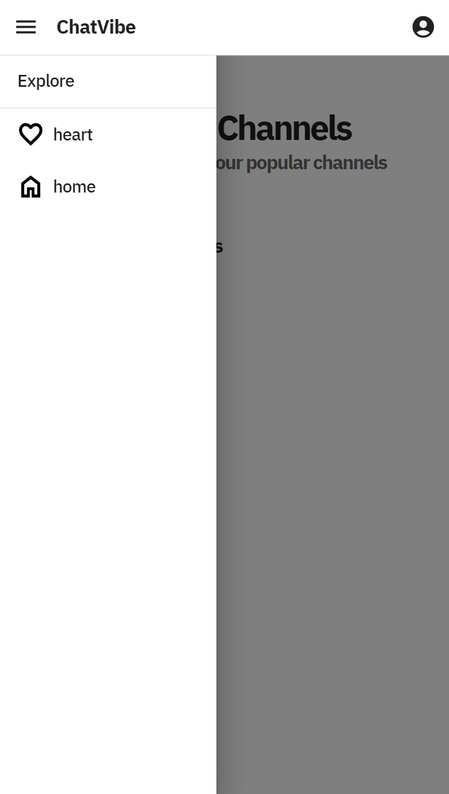

# ChatVibe

[](https://github.com/marketplace/actions/docker-login) 
[](https://github.com/artursniegowski/ChatVibe/actions/workflows/ci-backend.yaml)
[](https://codecov.io/gh/artursniegowski/ChatVibe)


ChatVibe is a full-stack web application built with Django REST Framework for the backend and React for the frontend. The application aims to provide a platform for users to engage in real-time chat conversations within categorized servers and channels, similar to popular platforms like Discord.

The backend of ChatVibe utilizes Django REST Framework to manage user authentication, server, and channel creation, as well as handling WebSocket connections for real-time communication. It also integrates with PostgreSQL database to store user data, server configurations, and chat histories.

The frontend, built with React and Material UI, offers a responsive and intuitive user interface. Users can browse through different server categories, join servers, and participate in chat rooms within each server. The frontend communicates with the backend API to fetch and send data, enabling seamless interaction and updates in real-time.

Key Features of ChatVibe include:

- User authentication and authorization using JWT tokens
- Creation and management of servers and channels
- Real-time chat functionality with WebSocket support
- Responsive design for optimal viewing on various devices
- Integration with PostgreSQL database for data storage and retrieval
- Secure communication through HTTPS and HTTP-only cookies tokens
- dark-mode
- Comprehensive unit tests
- CI with Github actions
- test coverage
- Websockets in django
- Uvicorn - ASGI web server for django
- Django Customization
- Django - channels
- redis - database
- nginx - reverse proxy
- react with TypeScript - frontend
- django - backend
- dockerized approach - microservices


ChatVibe is designed to be modular, scalable, and customizable, allowing developers to extend its functionality according to their specific requirements. Whether used for team collaboration, community building, or social networking, ChatVibe provides a robust and versatile platform for real-time communication.


## How to Start the Application

### Step 1: Adjust the Environmental Variables

1. Rename the folder `.dev-example` to `.dev` in the `.envs` directory.
2. Update the files in the `.envs` directory with your individual passwords, tokens, etc.
   - For example, in the `.docker_hub` file, obtain your own `DOCKERHUB_USER` and `DOCKERHUB_TOKEN` from Docker Hub.

### Step 2: Build and Run the Project

Make sure you have Docker installed and set up on your computer. Then, you can build the images and run the project with the following commands:

```
docker-compose build
docker-compose up
```

The website will be available at localhost or localhost:8080 as set in the docker-compose.yml nginx service.

To access the Django admin interface, navigate to localhost/admin or localhost:8080/admin.

Don't forget to create a superuser first with:
```
docker-compose run --rm backend sh -c "python manage.py createsuperuser"
```

Using Makefile for Shortcuts <br>
If you have make installed on your machine, you can use the Makefile for shortcuts for various commands, such as managing the database, testing, and managing backend services.

Running Tests <br>
Tests are written with unittest and can be run simply with:
```
make test
```

Checking Test Coverage <br>
To check the coverage, run:
```
make coverage-run-report
```

Checking Linting <br>
To check linting, run:
```
make format
```

Stoping all services:
```
make down
```

Check out the Makefile for more commands. <br>

Also remember to populate the website through the django admin with some data. <br>


API docs are available: <br>
http://localhost/api/docs/schema/swagger-ui/ <br>
http://localhost/api/docs/schema/redoc/ <br>


# APP overview:


***django admin page.***</br>


***django admin page.***</br>


***homepage page.***</br>
 

***homepage page - dark mode.***</br>
 

***homepage page - mobile.***</br>


***homepage page - mobile.***</br>
 

***sigin page.***</br>
 

***main page chat view.***</br>
 

***main page chat view - message.***</br>


***main page chat view - message - mobile.***</br>


***register page view.***</br>

